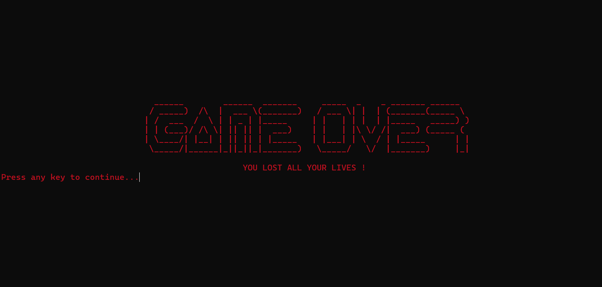

# Zuma Game (Assembly Language)
## Overview
This project implements a recreation of the classic Zuma game in Assembly language (x86 Architecture). The game involves controlling a frog shooter at the center of the screen that fires colored balls along predefined paths. The objective is to match three or more balls of the same color to clear them before they reach the end of the path. The game features multiple levels, increasing difficulty, and high score tracking.
## Features
•	 **Ball Movement**:  The balls move along curved paths, similar to the original Zuma game. The frog shooter can rotate to aim at the balls and fire them in the desired direction.  

• 	**Matching Mechanism**:  Balls that are fired must match at least two other balls of the same color to be removed from the screen. This mechanic is central to the game's strategy.  

• 	**Levels and Progression**:  The game has multiple levels, each with increasing difficulty. New obstacles, paths, and ball speeds are introduced as the player progresses.  

•	 **Lives and Game Over**:  Players have a set number of lives, which decrease each time a ball reaches the end of the path. The game ends when all lives are lost.  

• 	**High Scores**:  Players' scores are tracked, and at the end of the game, the high scores are displayed.

## Game Instructions
### Controls:
•	Use the (A, D) keys to rotate the frog (anti-clockwise, clockwise).

•	Use the spacebar to fire a ball.
### Gameplay:
•	Rotate the frog to aim at the balls.

•	Fire balls to create matches of three or more of the same color.

•	Clear all the balls before they reach the end of the path.

### Scoring:
•	Matching balls earns points.

•	Creating chain reactions earns bonus points.

### Game Over:
•	The game ends if any ball reaches the end of the path.
## Graphics
The game displays text-based visuals using simple characters and ASCII art for paths, tunnels, and game over/winning messages or any other displays.
#### Example:
##### Level 1

##### Level 2

##### Level 3

##### Game Over

## Libraries Used
1. Irvine32.inc
2. macros.inc
3. winmm.lib

Compile using MASM615 or any other compatible compiler.
## License
Licensed under [MIT](https://choosealicense.com/licenses/mit/), this project is open-source and free to use. Feel free to modify and distribute the code as you wish.

